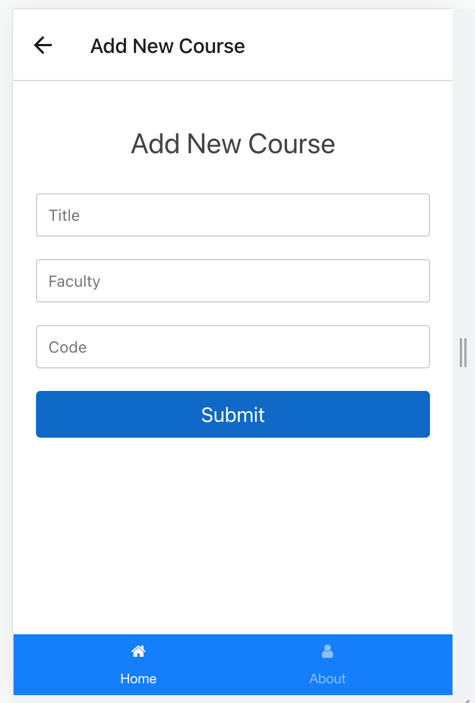
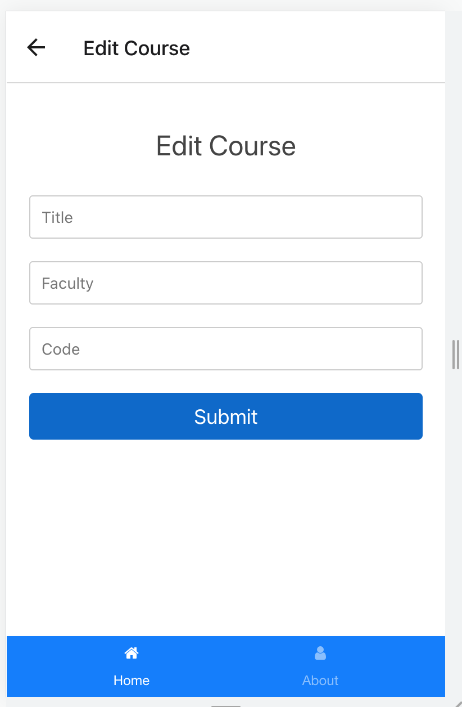

# CS571 Workshop 04 - Continue
## MIU Courses Review App
* Update the frontend to support Add/Edit/Delete a course. For deleting a course, you just need to display an alert to confirm `Do you want to delete this course?`
* Assume that we have a `departments` collection in `MongoDB` as follows:
```
{
    _id: ObjectId(),
    name: string,
    code: string,
    courses: [
        {
             _id: ObjectId(),
            title: string,
            code: string,
            faculty: string
        }
    ]    
}
```
* Write an Express server to support CRUD for courses, and make necessary changes in your app to communicate with the backend server:
    * Insert a department: `POST /departments`
    * Get all courses of a departement: `GET /departments/:department_code/courses`
    * Add a new course: `POST /departments/:department_code/courses`
    * Update the name of a course: `PUT /departments/:department_code/courses/:course_code`
    * Delete a course: `DELETE /departments/:department_code/courses/:course_code`
## Notes  
* Provid simple StyleSheet object.
* Do not upload any zip files into your repo.
* Do not push any deps (node_modules).
* Remember to honor the project integrity and authenticity of your code.
* Submission deadline is 10:00 PM CST.
    
## Please find screenshots for the finished application  

  
  

